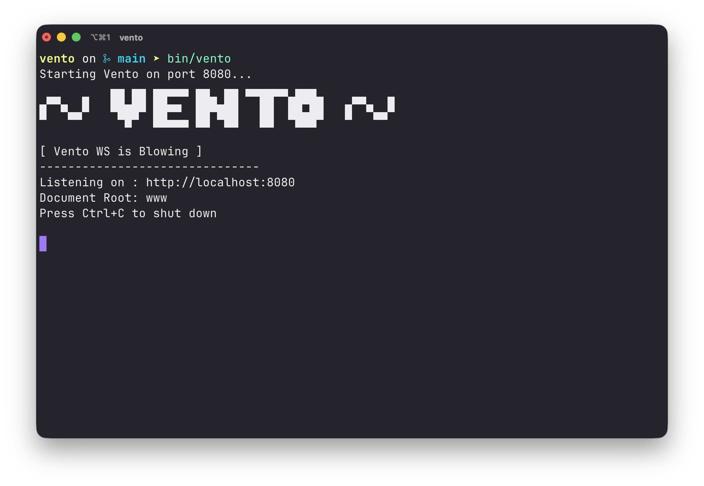

# ~ vento ~


**Vento** is a lightweight, blazing-fast, and multithreaded HTTP web server written from scratch in pure C. It utilizes raw POSIX sockets to serve static files and dynamic API responses with minimal overhead, making it an excellent educational resource for understanding how the web works under the hood.



## Features

- **Pure C Implementation:** No external dependencies, just standard C and POSIX libraries.
- **Multithreaded:** Handles concurrent client requests efficiently by spawning independent threads via `<pthread.h>`.
- **Dynamic Configuration:** Reads settings from a `vento.conf` file to dynamically set the `PORT` and `DOCUMENT_ROOT`.
- **Graceful Shutdown:** Safely intercepts `SIGINT` (Ctrl+C) and `SIGTERM` signals to cleanly release the bound ports and close running processes.
- **Request Logging:** Automatically intercepts IP addresses, requested URIs, HTTP methods, and response status codes, logging them to `vento.log` in Apache-style format.
- **Static File Serving:** Delivers HTML, CSS, JavaScript, and images straight from your configured document root.
- **Dynamic API Routing:** Parses full URLs (separating paths from query parameters) and extracts `POST` request bodies. Includes a built-in dynamic endpoint at `/api/echo`.
- **MIME Type Recognition:** Automatically detects and assigns the correct `Content-Type` headers for common file extensions.
- **Security:** Built-in protection against Directory Traversal (Path Traversal) attacks to ensure files outside the web root cannot be accessed.
- **Standard Routing:** Automatically resolves `/index.html` when a directory is requested and gracefully handles trailing slashes with HTTP `301 Moved Permanently` redirects.
- **Custom Error Pages:** Supports standard error handling, including `404 Not Found` and `403 Forbidden` pages.

## Getting Started

### Prerequisites

To build and run Vento, you need a UNIX-like environment (Linux, macOS, or WSL on Windows) with `gcc` and `make` installed.

### Building the Server

Clone the repository and run `make` in the root directory:

```bash
git clone https://github.com/nnevskij/vento
cd vento
make
```

This will compile the source code and place the executable in the `bin/` directory.

### Configuration

Vento automatically looks for a configuration file named `vento.conf` in the working directory. If omitted, it defaults to Port `8080` and Document Root `"www"`.

Example `vento.conf`:
```ini
PORT=3000
DOCUMENT_ROOT=www
```

### Running Vento

You can start the server by executing the compiled binary. You will be greeted by the Vento ASCII banner!

```bash
./bin/vento
```

You can optionally override the configured port by passing it as a direct argument:

```bash
./bin/vento 8081
```

Once running, simply open your browser and navigate to `http://localhost:3000` (or your configured port). Press `Ctrl+C` in the terminal to gracefully shut down the server.

### Testing the Dynamic API

Vento includes an example dynamic endpoint that intercepts `POST` requests. You can test it using `curl`:

```bash
curl -X POST http://localhost:8080/api/echo -d "Hello from Vento!"
```

## Directory Structure

- `src/`: Contains all the C source code for the server, HTTP parsing, logging, config loading, and utilities.
- `include/`: Header files defining the core structures and functions.
- `www/`: The default directory containing the static files (HTML, CSS, JS, images) served to clients.
- `bin/`: The output directory for the compiled executable.
- `obj/`: The directory where intermediate object files are stored during compilation.

## Cleaning Up

To remove the compiled binaries and intermediate object files, run:

```bash
make clean
```

## Contributing

Contributions, issues, and feature requests are welcome! Feel free to check the [issues page](https://github.com/nnevskij/vento/issues).

## License

This project is open-source and available under the [MIT License](LICENSE).